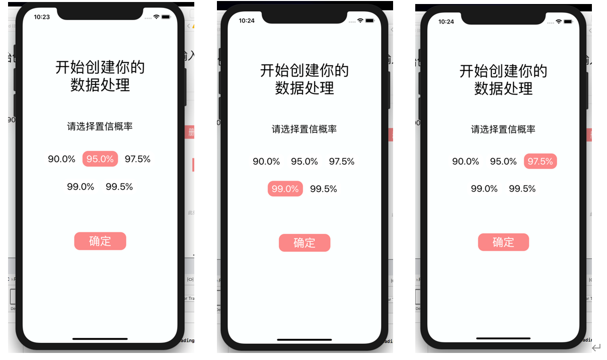
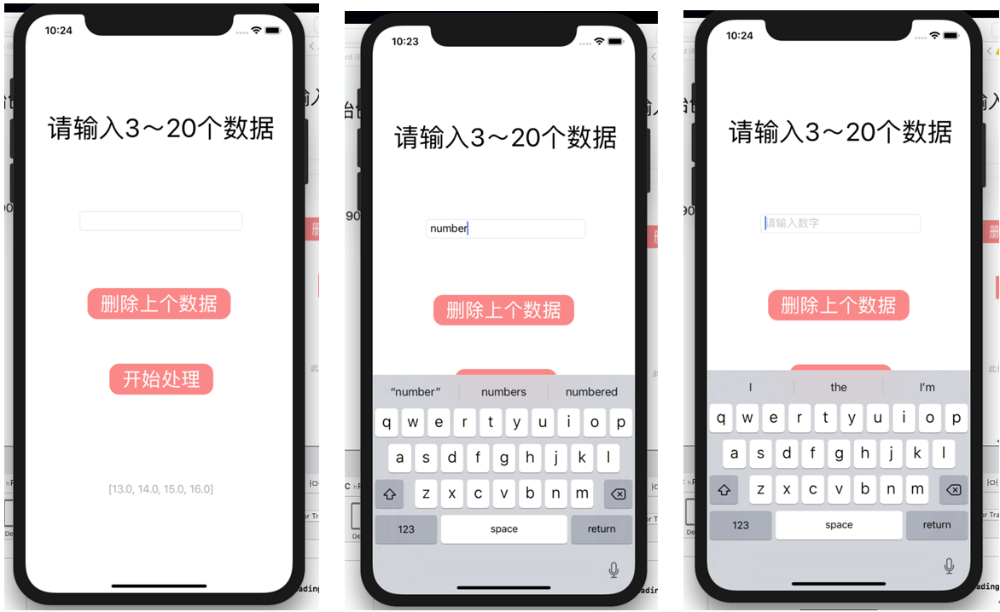
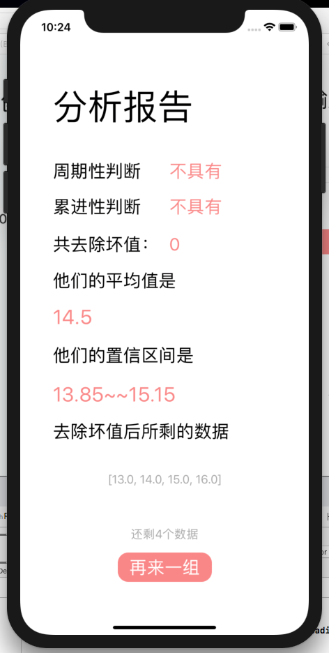

# date-processing-app

This is my first program on IOS, and it is made for processing date.

## Instruction
The first page you see when you enter the program is the confidence interval selection page, where you can select different probabilities by clicking on different buttons (95% is selected by default).

Once you have made your selection click the OK button to jump to the next page.

The data entered here will be displayed below, if non-numeric data is entered. This will be indicated.
Once the data has been entered you can click on Start processing. Once you have clicked on Start Processing, you will be taken to the final analysis report page.

This last page presents the results of the progressive and periodic judgements, the total number of bad values removed, the mean, the resulting confidence interval and the remaining data to the user at a glance. It also allows them to create another set.

